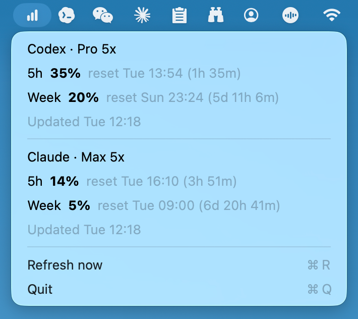

# Usage — Claude Code & Codex usage monitor in the macOS menu bar

A tiny macOS menu bar app that tracks your **Claude Code** (Anthropic) and **OpenAI Codex** usage and rate limits at a glance: 5-hour and weekly quota percentages, reset countdowns, and last-update times. No dashboards, no extra providers, no settings clutter.



## Why

If you use the Codex CLI or Claude Code on a Plus / Pro / Max plan, you work against 5-hour and weekly rate limits. Checking them means opening a web dashboard or running CLI commands. Usage keeps those numbers one click away in the status bar, refreshed automatically.

## Features

- Codex 5-hour and weekly usage percentages
- Claude 5-hour and weekly usage percentages
- Reset times with day/hour/minute countdowns
- Separate last-updated timestamps for Codex and Claude
- Background refresh every 5 minutes
- Manual refresh with `Command+R`
- Quick links to the Codex and Claude usage pages
- Native Swift + AppKit — no Electron, negligible memory footprint

## Data Sources

- Codex: reads `~/.codex/auth.json` and calls `https://chatgpt.com/backend-api/wham/usage`
- Claude: reads `~/.claude/.credentials.json` or the macOS Keychain item `Claude Code-credentials`, then calls `https://api.anthropic.com/api/oauth/usage`

## Requirements

- macOS 14 or newer
- Swift 6 or newer to build from source
- Logged-in Codex CLI and Claude Code accounts

## Build Locally

```bash
./build_app.sh
open Usage.app
```

The build script creates an ad-hoc signed `Usage.app` in the repository root.

## Easiest Way To Use

Download this project locally, open it with Codex or Claude Code, and ask the agent to build and run the app for you:

```text
Build this project, create Usage.app, and run it.
```

The agent can run the included `build_app.sh` script and open the generated app.

## FAQ

**How do I check my Claude Code usage and rate limits on macOS?**
Run Usage — it reads your existing Claude Code login (macOS Keychain or `~/.claude/.credentials.json`) and shows the 5-hour and weekly limit percentages plus reset countdowns in the menu bar.

**How do I check my Codex usage?**
Usage reads `~/.codex/auth.json` from a logged-in Codex CLI and shows the same 5-hour and weekly windows for Codex.

**Does it send my credentials anywhere?**
No. Tokens are read locally and used only to call the official usage endpoints at `chatgpt.com` and `api.anthropic.com`.

## 简体中文

Usage 是一个轻量的 macOS 菜单栏应用，用来实时查看 Claude Code 和 OpenAI Codex 的用量与速率限制（rate limit）：5 小时 / 每周配额百分比、重置倒计时、最近更新时间。本地读取已登录 CLI 的凭证，只请求官方用量接口，无需额外配置。

## License

MIT
